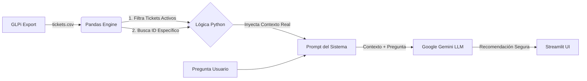
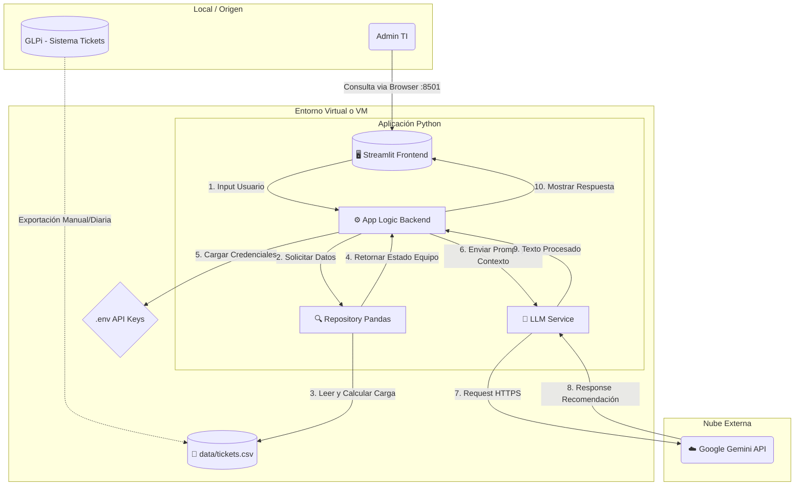

# Smart-IT Ops: GLPi Intelligent Advisor

Asistente basado en IA para infraestructura TI, diseñado para analizar cargas de trabajo de GLPi y sugerir asignaciones óptimas.

# Contexto del Proyecto: Problemática y Solución

## 🔴 La Problemática (Legacy Ops)

En la operación diaria de una Mesa de Ayuda (Service Desk), los coordinadores y Tech Leads enfrentan tres desafíos críticos que ralentizan el tiempo de resolución (MTTR):

1. Ceguera Operativa: Asignar tickets basándose en la intuición en lugar de datos reales. Es difícil saber quién está saturado y quién está libre sin revisar múltiples reportes.

2. Fatiga de Decisión: Leer descripciones técnicas complejas para decidir si un ticket es de "Redes", "Servidores" o "Soporte N1" consume tiempo valioso.

3. Riesgo de Seguridad en IA: El uso de herramientas públicas (como ChatGPT web) para analizar tickets implica un riesgo alto de fuga de datos (PII, contraseñas, IPs internas).

## 🟢 La Solución: Smart-IT Ops (Arquitectura)

Smart-IT es un sistema de Asistencia Operativa Basada en Contexto de Tecnicos y Tickets.

### Flujo de Datos (Arquitectura RAG Lite)

El sistema utiliza un enfoque de Retrieval-Augmented Generation (RAG) simplificado para garantizar que la IA nunca "alucine" datos ni invente técnicos que no existen.



## Estrategia del LLM

Para lograr respuestas precisas y seguras, implementamos tres capas de control en el modelo de lenguaje:

1. Inyección Dinámica de Contexto: La IA no tiene "memoria" de tu empresa. En cada consulta, el sistema inyecta en tiempo real la tabla de carga laboral (Técnico A: 5 tickets, Técnico B: 0 tickets) y el detalle del ticket consultado. Esto fuerza al modelo a responder basándose matemáticamente en la carga actual.

2. Guardrails de Privacidad (Sanitización): A través de Prompt Engineering defensivo, el sistema está instruido para detectar patrones sensibles (IPs, Hashes, Contraseñas) y censurarlos o ignorarlos antes de generar una respuesta, protegiendo la integridad de la infraestructura.

3. Determinismo sobre Creatividad: Configuramos el modelo con una temperatura baja (0.3). No queremos un poeta; queremos un ingeniero. Las respuestas son directas, técnicas y justificadas con datos ("Asigna a X porque tiene Y carga").

## 📋 Requisitos Previos
- Windows 11 (PowerShell)
- Python 3.10+
- Acceso a GLPi (para exportar CSV)
- Google Gemini API Key

## 🚀 Instalación y Despliegue (Windows)

### 1. Preparar el Entorno

#### Windows
Abrir PowerShell en la carpeta raíz del proyecto:

```powershell
# Crear entorno virtual
python -m venv venv

# Activar entorno (Windows)
.\venv\Scripts\Activate.ps1

# Instalar dependencias
pip install -r requirements.txt

# Desactivar entorno (Windows)
deactivate
```

#### Ubuntu
```powershell
# Crear entorno virtual
python3 -m venv venv

# Activar entorno (ubuntu)
source venv/bin/activate

# Instalar dependencias
pip install -r requirements.txt

# Desactivar entorno (ubuntu)
deactivate
```

## ⚙️ Configuración de Variables de Entorno (.env)

El archivo .env actúa como una "caja fuerte" que guarda sus claves secretas y preferencias locales.

### Pasos para crearlo:
1. Navegue a la carpeta raíz del proyecto.
2. Cree un nuevo archivo de texto vacío.
3. Renómbrelo a: .env (Importante eliminar el formato .txt).
4. Abra el archivo con un editor de texto y pegue el siguiente contenido:

```
# ==========================================
# CONFIGURACIÓN DE APP
# ==========================================

# [OBLIGATORIO] API Key de Google Gemini
# Obténgala aquí: https://aistudio.google.com/app/apikey
GOOGLE_API_KEY=pegue_aqui_su_api_key_sin_comillas

# [OPCIONAL]
GLPI_CSV_FILENAME=tickets.csv
```

# Tu VS Code no te reconoce tus dependencias?
Esto ocurre porque VS Code esta "mirando" tu Python global para hacer el autocompletado y la revision de errores.

### Para arreglarlo selecciona el interprete Correcto:
    1. Presiona Ctrl + Shift + P (o Cmd + Shift + P en Mac) para abrir la paleta de comandos.
    2. Escribe y selecciona: Python: Select Interpreter.
    3. Verás una lista. Busca la opción que diga algo como:
     - Python 3.x.x ('venv': venv) 👈 Esta es la correcta.
     - O que tenga la ruta ./venv/Scripts/python.exe.
    4. Selecciónala.
    5. Espera unos segundos. El error de Pylance debería desaparecer.

# Quieres consultar los modelos que tienes disponibles?
```powershell
#Encontrar modelos disponibles de Gemini
cd .\services\
python test_models.py
```

# Para correr la aplicación
```powershell
#Correr proyecto
streamlit run app.py
```

## 🏗️ Arquitectura de la Solución

El siguiente diagrama ilustra el flujo de datos entre el usuario, la capa lógica en AWS y el servicio de IA.


