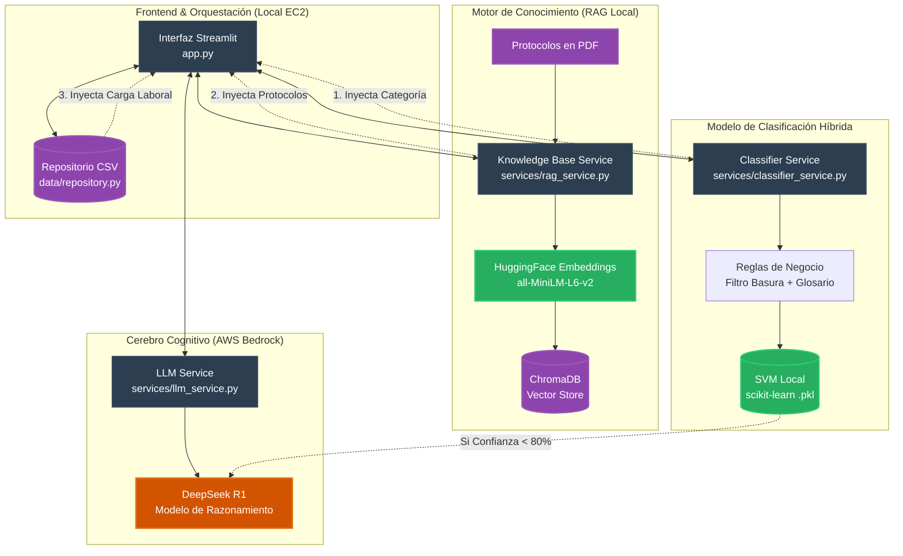
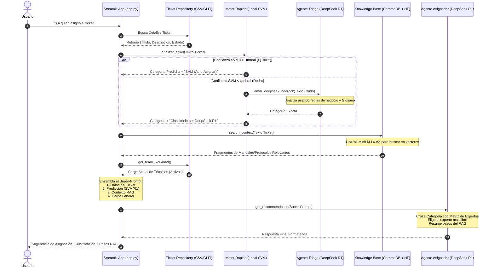

# Smart-IT Ops: GLPi Intelligent Advisor

Asistente basado en IA para infraestructura TI, diseñado para analizar cargas de trabajo de GLPi y sugerir asignaciones óptimas. **Smart-IT Ops Advisor** es una aplicación de inteligencia artificial diseñada para optimizar las operaciones de una Mesa de Ayuda de TI. Actúa como un *Tech Lead Virtual* capaz de clasificar, enrutar y sugerir asignaciones de tickets de soporte técnico (provenientes de sistemas como GLPi) basándose en la carga de trabajo del equipo, especialidades técnicas y manuales de procedimiento.

## La Problemática (Legacy Ops)

En la operación diaria de una Mesa de Ayuda (Service Desk), los coordinadores y Tech Leads enfrentan tres desafíos críticos que ralentizan el tiempo de resolución (MTTR):

1. Ceguera Operativa: Asignar tickets basándose en la intuición en lugar de datos reales. Es difícil saber quién está saturado y quién está libre sin revisar múltiples reportes.

2. Fatiga de Decisión: Leer descripciones técnicas complejas para decidir si un ticket es de "Redes", "Servidores" o "Soporte N1" consume tiempo valioso.

3. Riesgo de Seguridad en IA: El uso de herramientas públicas (como ChatGPT web) para analizar tickets implica un riesgo alto de fuga de datos (PII, contraseñas, IPs internas).

## Requisitos Previos
Para ejecutar este proyecto, necesitarás:

* **Python 3.10+** instalado en tu entorno o servidor.
* Credenciales configuradas de **AWS** (Access Key ID y Secret Access Key) con permisos para usar **Amazon Bedrock** (y el acceso habilitado para el modelo DeepSeek R1 o el que estés utilizando).
* Archivos base del modelo SVM pre-entrenado: `svm_pipeline.pkl` y `label_encoder.pkl`.

## Estructura del proyecto

```text
/Smart-IT-Ops
├── app.py                      # Interfaz gráfica principal (Streamlit)
├── requirements.txt            # Dependencias del proyecto
├── .env                        # Variables de entorno (NO subir a git)
├── /config
│   └── settings.py             # Configuraciones y rutas del sistema
├── /data
│   ├── tickets.csv             # Exportación de tickets activos desde GLPi
│   ├── /models                 # Modelos entrenados locales
│   │   ├── svm_pipeline.pkl
│   │   └── label_encoder.pkl
│   ├── /protocols              # Manuales y PDFs para el sistema RAG
│   └── /vector_store           # Base de datos vectorial (ChromaDB)
└── /services
    ├── classifier_service.py   # Lógica del Model Cascade (SVM -> DeepSeek)
    ├── llm_service.py          # Agente principal (AWS Bedrock)
    ├── llm_service_gemini.py   # Agente secundario montado (Gemini API)
    ├── test_models.py          # Funcion complementaria para ver los modelos disponibles de Gemini
    └── rag_service.py          # Motor de búsqueda vectorial (HuggingFace + Chroma)
```

## Requisitos Previos

Para ejecutar este proyecto, necesitarás:

* **Python 3.10+** instalado en tu entorno o servidor.
* Credenciales configuradas de **AWS** (Access Key ID y Secret Access Key) con permisos para usar **Amazon Bedrock** (y el acceso habilitado para el modelo DeepSeek R1 o el que estés utilizando).
* Archivos base del modelo SVM pre-entrenado: `svm_pipeline.pkl` y `label_encoder.pkl`.

## Arquitectura 

El corazón de este sistema es un patrón de arquitectura conocido como **Model Cascade** o **Enrutamiento Híbrido**, que combina velocidad, bajo costo y razonamiento profundo:

1.  **Nivel 1 (clasificador):** Un modelo de *Support Vector Machine (SVM)* entrenado localmente. Intercepta todos los tickets entrantes sin categoria. Si el modelo tiene una alta confianza (ej. >80%), clasifica automáticamente el ticket (ej. "Ciberseguridad") sin gastar tokens ni llamadas a APIs externas.
2.  **Nivel 2 (GenIA):** Si la SVM detecta ambigüedad o tiene baja confianza (el 20% de los casos "grises"), el sistema delega el análisis al modelo **DeepSeek R1** a través de **AWS Bedrock**. Este modelo analiza el contexto complejo y determina la categoría.

Ambos niveles representan el modelo hibrido para poder clasificar los ticket que estan sin categoria asignada. Los cuales retrasan en 14 horas promedio la resolucion de los tickets. Esta propuesta sirve de contexto extra para el asignador de personas y le aumenta la precision.

3.  **El Orquestador (Asignación y RAG):** Una vez que el ticket está categorizado, un agente conversacional (DeepSeek R1) lee la carga laboral actual de los técnicos (mediante un CSV exportado de GLPi) y los manuales de procedimiento de la empresa usando **RAG (Retrieval-Augmented Generation)** con un modelo de embeddings de HuggingFace (`all-MiniLM-L6-v2`) operando localmente vía ChromaDB. Finalmente, sugiere al técnico ideal y le proporciona los pasos del protocolo a seguir.


```mermaid
graph TD
    subgraph "Frontend & Orquestación (Local EC2)"
        UI[Interfaz Streamlit<br/>app.py]
        Repo[(Repositorio CSV<br/>data/repository.py)]
    end

    subgraph "Modelo de Clasificación Híbrida"
        Clasificador[Classifier Service<br/>services/classifier_service.py]
        SVM[(SVM Local<br/>scikit-learn .pkl)]
        Reglas[Reglas de Negocio<br/>Filtro Basura + Glosario]
        
        Clasificador --> Reglas
        Reglas --> SVM
    end

    subgraph "Motor de Conocimiento (RAG Local)"
        KB[Knowledge Base Service<br/>services/rag_service.py]
        HF[HuggingFace Embeddings<br/>all-MiniLM-L6-v2]
        Chroma[(ChromaDB<br/>Vector Store)]
        PDFs[Protocolos en PDF]
        
        KB --> HF
        HF --> Chroma
        PDFs --> KB
    end

    subgraph "Cerebro Cognitivo (AWS Bedrock)"
        LLM[LLM Service<br/>services/llm_service.py]
        DeepSeek[DeepSeek R1<br/>Modelo de Razonamiento]
        LLM --> DeepSeek
    end

    %% Conexiones Principales
    UI <--> Repo
    UI <--> KB
    UI <--> Clasificador
    UI <--> LLM

    %% El Cascade Hacia AWS
    SVM -. "Si Confianza < 80%" .-> DeepSeek
    
    %% Flujo de Inyección al Prompt Final
    Clasificador -. "1. Inyecta Categoría" .-> UI
    KB -. "2. Inyecta Protocolos" .-> UI
    Repo -. "3. Inyecta Carga Laboral" .-> UI
    
    %% Leyenda Estética
    classDef local fill:#2C3E50,stroke:#34495E,stroke-width:2px,color:#fff;
    classDef cloud fill:#D35400,stroke:#E67E22,stroke-width:2px,color:#fff;
    classDef ai fill:#27AE60,stroke:#2ECC71,stroke-width:2px,color:#fff;
    classDef data fill:#8E44AD,stroke:#9B59B6,stroke-width:2px,color:#fff;

    class UI,Clasificador,KB,LLM local;
    class DeepSeek cloud;
    class SVM,HF ai;
    class Repo,Chroma,PDFs data;
```

### Diagrama de Flujo de Datos

El sistema utiliza un enfoque de Retrieval-Augmented Generation (RAG) simplificado para garantizar que la IA nunca "alucine" datos ni invente técnicos que no existen.


```mermaid
sequenceDiagram
    autonumber
    actor Usuario
    participant Interfaz as Streamlit App (app.py)
    participant Repo as Ticket Repository (CSV/GLPi)
    participant SVM as Motor Rápido (Local SVM)
    participant Bedrock1 as Agente Triage (DeepSeek R1)
    participant RAG as Knowledge Base (ChromaDB + HF)
    participant Bedrock2 as Agente Asignador (DeepSeek R1)

    Usuario->>Interfaz: "¿A quién asigno el ticket #102?"
    
    Interfaz->>Repo: Busca Detalles Ticket #102
    Repo-->>Interfaz: Retorna (Título, Descripción, Estado)
    
    Interfaz->>SVM: analizar_ticket(Texto Ticket)
    
    alt Confianza SVM >= Umbral (Ej. 80%)
        SVM-->>Interfaz: Categoría Predicha + "SVM (Auto-Asignar)"
    else Confianza SVM < Umbral (Duda)
        SVM->>Bedrock1: _llamar_deepseek_bedrock(Texto Crudo)
        Note over Bedrock1: Analiza usando reglas de negocio y Glosario
        Bedrock1-->>SVM: Categoría Exacta
        SVM-->>Interfaz: Categoría + "Clasificado por DeepSeek R1"
    end
    
    Interfaz->>RAG: search_context(Texto Ticket)
    Note over RAG: Usa 'all-MiniLM-L6-v2' para buscar en vectores
    RAG-->>Interfaz: Fragmentos de Manuales/Protocolos Relevantes
    
    Interfaz->>Repo: get_team_workload()
    Repo-->>Interfaz: Carga Actual de Técnicos (Activos)
    
    Note over Interfaz: Ensambla el Súper-Prompt:<br/>1. Datos del Ticket<br/>2. Predicción (SVM/R1)<br/>3. Contexto RAG<br/>4. Carga Laboral
    
    Interfaz->>Bedrock2: get_recommendation(Súper-Prompt)
    Note over Bedrock2: Cruza Categoría con Matriz de Expertos<br/>Elige al experto más libre<br/>Resume pasos del RAG
    Bedrock2-->>Interfaz: Respuesta Final Formateada
    
    Interfaz-->>Usuario: Sugerencia de Asignación + Justificación + Pasos RAG
```

## Estrategia del LLM

Para lograr respuestas precisas y seguras, implementamos tres capas de control en el modelo de lenguaje:

1. Inyección Dinámica de Contexto: La IA no tiene "memoria" de tu empresa. En cada consulta, el sistema inyecta en tiempo real la tabla de carga laboral (Técnico A: 5 tickets, Técnico B: 0 tickets) y el detalle del ticket consultado. Esto fuerza al modelo a responder basándose matemáticamente en la carga actual.

2. Guardrails de Privacidad (Sanitización): A través de Prompt Engineering defensivo, el sistema está instruido para detectar patrones sensibles (IPs, Hashes, Contraseñas) y censurarlos o ignorarlos antes de generar una respuesta, protegiendo la integridad de la infraestructura.

3. Determinismo sobre Creatividad: Configuramos el modelo con una temperatura baja (0.3). No queremos un poeta; queremos un ingeniero. Las respuestas son directas, técnicas y justificadas con datos ("Asigna a X porque tiene Y carga").

## configuración y Despliegue

### Levantar el servicio
Sigue estos pasos para levantar la aplicación en tu entorno local o servidor (ej. EC2):

1. Clonar el repositorio e instalar dependencias
```powershell
#clonar proyecto
git clone <repositorio>

#ingresar al proyecto
cd CONTEXT-LLM-TICKETS
```

#### Windows
Abrir PowerShell en la carpeta raíz del proyecto:

```powershell
# Crear entorno virtual
python -m venv venv

# Activar entorno (Windows)
.\venv\Scripts\Activate.ps1

# Instalar dependencias
pip install -r requirements.txt

# Desactivar entorno (Windows)
deactivate
```

#### Ubuntu
```powershell
# Crear entorno virtual
python3 -m venv venv

# Activar entorno (ubuntu)
source venv/bin/activate

# Instalar dependencias
pip install -r requirements.txt

# Desactivar entorno (ubuntu)
deactivate
```

*nota: Asegúrate de que tu requirements.txt incluya: streamlit, pandas, scikit-learn, joblib, boto3, python-dotenv, chromadb, pypdf, sentence-transformers*

### Tu VS Code no te reconoce tus dependencias?
Esto ocurre porque VS Code esta "mirando" tu Python global para hacer el autocompletado y la revision de errores. Posiblemente es por configuración del interprete.

### Para arreglarlo selecciona el interprete Correcto:
    1. Presiona Ctrl + Shift + P (o Cmd + Shift + P en Mac) para abrir la paleta de comandos.
    2. Escribe y selecciona: Python: Select Interpreter.
    3. Verás una lista. Busca la opción que diga algo como:
     - Python 3.x.x ('venv': venv) Esta es la correcta.
     - O que tenga la ruta ./venv/Scripts/python.exe.
    4. Selecciónala.
    5. Espera unos segundos. El error de Pylance debería desaparecer.


### Configuración de Variables de Entorno (.env)
El archivo .env actúa como una "caja fuerte" que guarda sus claves secretas y preferencias locales.

### Pasos para crearlo:
1. Navegue a la carpeta raíz del proyecto.
2. Cree un nuevo archivo de texto vacío.
3. Renómbrelo a: .env (Importante eliminar el formato .txt).
4. Abra el archivo con un editor de texto y pegue el siguiente contenido:

```
# ==========================================
# CONFIGURACIÓN DE APP
# ==========================================

# [OBLIGATORIO] API Key de Google Gemini
# Obténgala aquí: https://aistudio.google.com/app/apikey
GOOGLE_API_KEY=pegue_aqui_su_api_key_sin_comillas

# [OPCIONAL]
GLPI_CSV_FILENAME=tickets.csv

#DEEPSEEK
AWS_ACCESS_KEY_ID= AQUI_TU_KEY_ID
AWS_SECRET_ACCESS_KEY= AQUI_TU_SECRET_KEY
AWS_REGION= REGION_AWS
DEEPSEEK_MODEL_ID= MODELO_QUE_USAS
```

### Quieres consultar los modelos que tienes disponibles?
```powershell
#Encontrar modelos disponibles de Gemini
cd .\services\
python test_models.py
```
### Para ejecutar la aplicación
```powershell
#Correr proyecto
streamlit run app.py
```

## Preparar los Datos y Modelos
Los modelos vienen pre-entrenados y subimos por defecto, si se desea renovar o cambiar los modelos sigan los siguientes pasos:

    1. Copia tus archivos svm_pipeline.pkl y label_encoder.pkl dentro de la carpeta data/models/.
    2. Exporta tus tickets actuales desde GLPi como tickets.csv (usando ; como separador) y colócalo en la carpeta data/.
    3. Copia tus manuales o procedimientos en formato .txt o .pdf dentro de la carpeta data/protocols/.

## Post-Instalación (Indexación RAG)

La primera vez que arranques la aplicación, el motor de conocimiento (RAG) estará vacío.

    1. Abre la aplicación en tu navegador (usualmente http://localhost:8501).
    2. Ve a la barra lateral izquierda y haz clic en el botón "🔄 Re-indexar PDFs".
    3. El sistema descargará el modelo de embeddings local de HuggingFace (solo la primera vez) y vectorizará todos tus manuales.

# Uso del sistema
- **Métricas en Vivo**: Observa la carga de trabajo de tu equipo actualizada al instante en la barra lateral.
- **Asignación Inteligente**: En el chat principal, escribe algo como: "¿A quién le asigno el ticket #102?". El sistema pasará el ticket por el motor SVM, deducirá la categoría, verificará quién está disponible, leerá el manual pertinente y te dará una recomendación justificada.
- **Gestión de Pendientes**: Si solo preguntas "¿Qué tickets tengo pendientes?", el agente evaluará tu cola de trabajo sin asignar y sugerirá acciones para descongestionarla.

# Pruebas de uso LLM

*Prompt:* "Recomienda un técnico para el id [ID_REAL]"

*Prompt:* "Analiza el ticket #[ID_REAL] y dime qué habilidades técnicas necesita el técnico para resolverlo."

*Prompt:* ""Tengo un ticket de mantenimiento general muy sencillo. ¿A quién debería asignárselo para no sobrecargar al equipo?""

*Prompt:* "Asigna el ticket #[ID_DE_REDES]. Es urgente."

*Prompt:* "Si llega un ticket crítico sobre caída del Firewall, ¿quién es el más apto para verlo según la carga actual?"
