# Smart-IT Ops: GLPi Intelligent Advisor

Asistente basado en IA para infraestructura TI, diseñado para analizar cargas de trabajo de GLPi y sugerir asignaciones óptimas.

## 📋 Requisitos Previos
- Windows 11 (PowerShell)
- Python 3.10+
- Acceso a GLPi (para exportar CSV)
- Google Gemini API Key

## 🚀 Instalación y Despliegue (Windows)

### 1. Preparar el Entorno

#### Windows
Abrir PowerShell en la carpeta raíz del proyecto:

```powershell
# Crear entorno virtual
python -m venv venv

# Activar entorno (Windows)
.\venv\Scripts\Activate.ps1

# Instalar dependencias
pip install -r requirements.txt

# Desactivar entorno (Windows)
deactivate
```

#### Ubuntu
```powershell
# Crear entorno virtual
python3 -m venv venv

# Activar entorno (ubuntu)
source venv/bin/activate

# Instalar dependencias
pip install -r requirements.txt

# Desactivar entorno (ubuntu)
deactivate
```

## ⚙️ Configuración de Variables de Entorno (.env)

El archivo .env actúa como una "caja fuerte" que guarda sus claves secretas y preferencias locales.

### Pasos para crearlo:
1. Navegue a la carpeta raíz del proyecto.
2. Cree un nuevo archivo de texto vacío.
3. Renómbrelo a: .env (Importante eliminar el formato .txt).
4. Abra el archivo con un editor de texto y pegue el siguiente contenido:

```
# ==========================================
# CONFIGURACIÓN DE APP
# ==========================================

# [OBLIGATORIO] API Key de Google Gemini
# Obténgala aquí: https://aistudio.google.com/app/apikey
GOOGLE_API_KEY=pegue_aqui_su_api_key_sin_comillas

# [OPCIONAL]
GLPI_CSV_FILENAME=tickets.csv
```

# Tu VS Code no te reconoce tus dependencias?
Esto ocurre porque VS Code esta "mirando" tu Python global para hacer el autocompletado y la revision de errores.

### Para arreglarlo selecciona el interprete Correcto:
    1. Presiona Ctrl + Shift + P (o Cmd + Shift + P en Mac) para abrir la paleta de comandos.
    2. Escribe y selecciona: Python: Select Interpreter.
    3. Verás una lista. Busca la opción que diga algo como:
     - Python 3.x.x ('venv': venv) 👈 Esta es la correcta.
     - O que tenga la ruta ./venv/Scripts/python.exe.
    4. Selecciónala.
    5. Espera unos segundos. El error de Pylance debería desaparecer.

# Quieres consultar los modelos que tienes disponibles?
```powershell
#Encontrar modelos disponibles de Gemini
cd .\services\
python test_models.py
```

# Para correr la aplicación
```powershell
#Correr proyecto
streamlit run app.py
```

## 🏗️ Arquitectura de la Solución

El siguiente diagrama ilustra el flujo de datos entre el usuario, la capa lógica en AWS y el servicio de IA.

```mermaid
graph TD
    subgraph "Local / Origen"
        GLPi[("GLPi - Sistema Tickets")]
        Admin("Admin TI")
    end

    subgraph "Entorno Virtual o VM"
        direction TB
        CSV[("📂 data/tickets.csv")]
        Env{".env API Keys"}
        
        subgraph "Aplicación Python"
            UI[("🖥️ Streamlit Frontend")]
            Logic["⚙️ App Logic Backend"]
            Repo["🔍 Repository Pandas"]
            Service["🧠 LLM Service"]
        end
    end

    subgraph "Nube Externa"
        Gemini("☁️ Google Gemini API")
    end

    %% Flujo de Datos
    GLPi -.->|Exportación Manual/Diaria| CSV
    Admin -->|Consulta via Browser :8501| UI
    
    %% Proceso Interno
    UI -->|1. Input Usuario| Logic
    Logic -->|2. Solicitar Datos| Repo
    Repo -->|3. Leer y Calcular Carga| CSV
    Repo -->|4. Retornar Estado Equipo| Logic
    
    Logic -->|5. Cargar Credenciales| Env
    Logic -->|6. Enviar Prompt y Contexto| Service
    
    %% IA
    Service -->|7. Request HTTPS| Gemini
    Gemini -->|8. Response Recomendación| Service
    
    %% Respuesta Final
    Service -->|9. Texto Procesado| Logic
    Logic -->|10. Mostrar Respuesta| UI
```


